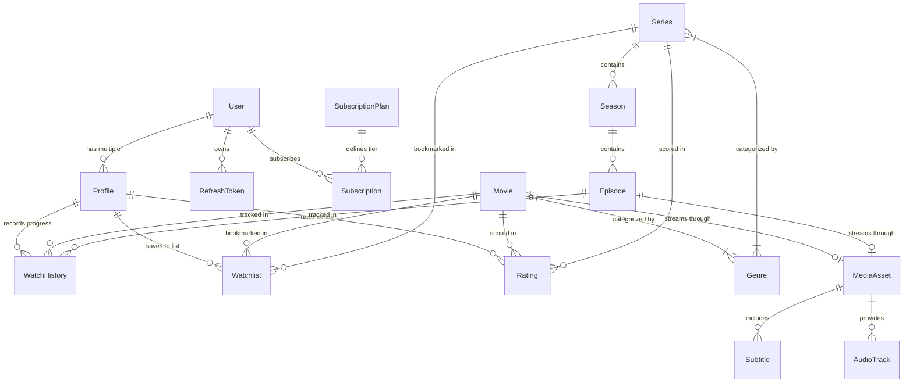

# Database Design & Modeling

The streaming platform utilizes **PostgreSQL 16** modeled with strict relational normalization, foreign key referential integrity, composite indexes, soft-deletes, and duplicate prevention constraints.

---

## 1. Entity-Relationship Model



---

## 2. Table Specifications & Indexes

### Identity & Access Control

- `users`:
  - `id`: UUID (PK)
  - `email`: VARCHAR(255) (UNIQUE, INDEXED)
  - `passwordHash`: VARCHAR(255) (bcrypt/Argon2)
  - `role`: ENUM ('USER', 'ADMIN', 'CONTENT_MANAGER', 'MODERATOR')
  - `isEmailVerified`, `isActive`
  - `createdAt`, `updatedAt`, `deletedAt` (SoftDelete)
- `profiles`:
  - `id`: UUID (PK)
  - `userId`: UUID (FK -> users, ON DELETE CASCADE, INDEXED)
  - `name`: VARCHAR(50)
  - `avatarUrl`, `isKids`, `maturityRating` ('ALL', '7+', '13+', '16+', '18+')
  - `language` (default 'en'), `pin` (hashed), `autoplayNext`
  - Composite Index: `(userId, name)`
- `refresh_tokens`:
  - `id`: UUID (PK)
  - `userId`: UUID (FK -> users, ON DELETE CASCADE, INDEXED)
  - `tokenHash`: VARCHAR(255) (UNIQUE, INDEXED)
  - `expiresAt`, `isRevoked`, `userAgent`, `ipAddress`

### Content Catalog

- `genres`:
  - `id`: UUID (PK), `name` (UNIQUE), `slug` (UNIQUE, INDEXED)
- `categories`:
  - `id`: UUID (PK), `name`, `slug` (UNIQUE, INDEXED), `displayOrder` (INT), `isActive` (BOOLEAN)
- `movies`:
  - `id`: UUID (PK)
  - `title`: VARCHAR(255) (INDEXED), `slug`: VARCHAR(255) (UNIQUE, INDEXED)
  - `description`: TEXT, `releaseDate`: DATE, `durationMinutes`: INT
  - `ageRating`, `language`, `country`, `posterUrl`, `backdropUrl`, `trailerUrl`
  - `status`: ENUM ('DRAFT', 'PROCESSING', 'PUBLISHED', 'ARCHIVED', INDEXED)
  - `viewCount`: INT, `averageRating`: NUMERIC(3, 1)
  - `mediaAssetId`: UUID (FK -> media_assets, NULLABLE)
  - `createdAt`, `updatedAt`, `deletedAt` (SoftDelete)
- `series`:
  - `id`: UUID (PK), `title` (INDEXED), `slug` (UNIQUE, INDEXED), `description`: TEXT
  - `releaseDate`, `ageRating`, `language`, `posterUrl`, `backdropUrl`, `trailerUrl`
  - `status`: ENUM ('DRAFT', 'PROCESSING', 'PUBLISHED', 'ARCHIVED')
- `seasons`:
  - `id`: UUID (PK), `seriesId`: UUID (FK -> series, ON DELETE CASCADE, INDEXED)
  - `seasonNumber`: INT, `title`: VARCHAR(150), `description`: TEXT
  - Unique Constraint: `(seriesId, seasonNumber)`
- `episodes`:
  - `id`: UUID (PK), `seasonId`: UUID (FK -> seasons, ON DELETE CASCADE, INDEXED)
  - `episodeNumber`: INT, `title`: VARCHAR(255), `durationMinutes`: INT, `thumbnailUrl`: VARCHAR(1000)
  - `mediaAssetId`: UUID (FK -> media_assets, NULLABLE)
  - Unique Constraint: `(seasonId, episodeNumber)`

### Media & Playback Pipeline

- `media_assets`:
  - `id`: UUID (PK), `masterPlaylistUrl`: VARCHAR(1000), `durationSeconds`: INT
  - `resolutions`: simple-array ('1080p,720p,480p,360p'), `status`: ('PROCESSING', 'READY', 'FAILED')
- `subtitles`:
  - `id`: UUID (PK), `mediaAssetId`: UUID (FK -> media_assets, ON DELETE CASCADE, INDEXED)
  - `language`: VARCHAR(10), `label`: VARCHAR(50), `url`: VARCHAR(1000), `isDefault`: BOOLEAN
- `audio_tracks`:
  - `id`: UUID (PK), `mediaAssetId`: UUID (FK -> media_assets, ON DELETE CASCADE, INDEXED)
  - `language`: VARCHAR(10), `label`: VARCHAR(50), `url`: VARCHAR(1000), `isDefault`: BOOLEAN

### Engagement & User Activity

- `watch_history`:
  - `id`: UUID (PK), `profileId`: UUID (FK -> profiles, ON DELETE CASCADE, INDEXED)
  - `movieId`: UUID (FK -> movies, NULLABLE), `episodeId`: UUID (FK -> episodes, NULLABLE)
  - `positionSeconds`: INT, `durationSeconds`: INT, `progressPercentage`: NUMERIC(5, 2)
  - `completed`: BOOLEAN, `lastWatchedAt`: TIMESTAMPTZ
  - Composite Indexes: `(profileId, movieId)`, `(profileId, episodeId)`
- `watchlists`:
  - `id`: UUID (PK), `profileId`: UUID (FK -> profiles, ON DELETE CASCADE, INDEXED)
  - `movieId`: UUID (FK -> movies, NULLABLE), `seriesId`: UUID (FK -> series, NULLABLE)
  - Unique Constraints: `(profileId, movieId)` WHERE movieId IS NOT NULL; `(profileId, seriesId)` WHERE seriesId IS NOT NULL
- `ratings`:
  - `id`: UUID (PK), `profileId`: UUID (FK -> profiles, ON DELETE CASCADE, INDEXED)
  - `movieId`: UUID (FK -> movies, NULLABLE), `seriesId`: UUID (FK -> series, NULLABLE)
  - `score`: SMALLINT (CHECK 1 <= score <= 5)
  - Unique Constraints: `(profileId, movieId)` WHERE movieId IS NOT NULL; `(profileId, seriesId)` WHERE seriesId IS NOT NULL

### Subscriptions & Monetization

- `subscription_plans`:
  - `id`: UUID (PK), `name` (UNIQUE), `tier`, `price` NUMERIC(10,2), `currency`, `maxQuality`, `maxDevices`, `isActive`
- `subscriptions`:
  - `id`: UUID (PK), `userId`: UUID (FK -> users, ON DELETE CASCADE, INDEXED)
  - `planId`: UUID (FK -> subscription_plans, ON DELETE RESTRICT, INDEXED)
  - `status`: ('ACTIVE', 'CANCELED', 'EXPIRED', 'PAST_DUE')
  - `currentPeriodStart`, `currentPeriodEnd`, `cancelAtPeriodEnd`

---

## 3. Seed Execution

Seed data is executed idempotently via `SeedService` or npm script:

```bash
npm run db:seed
```

Seeds:

- Administrator user (`admin@streamflix.local`) & standard user (`user@streamflix.local`)
- Multi-profiles with maturity levels and kids mode
- 12 genres & 5 dynamic categories
- 4 subscription tiers (FREE, BASIC, STANDARD, PREMIUM)
- 4 fictional movies with HLS media assets and multi-language subtitles
- Fictional series ("Neon District") with Season 1 and streaming episodes
